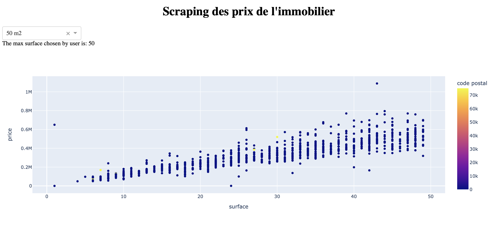

# Real Estrate Scrapping

## But du projet

Le but de ce projet est de scrapper les données des prix de l'immobilier et d'établir quelques statistiques. Le site pare-vendu a été utilisé.

## Technos utilisées

- Python3
- Librairies : Pandas, BeautifulSoup, Dash,...

## Réalisation d'une appli web

Présentation des résultats avec un outil de dataviz (dash)



## Utilisation

Installation des librairies
```
pip install -r requirements.txt
````

Choix d'un code postal dans le fichier `dash_app.py` puis lancement de l'appli web avec la commande :
```
python dash_app.py
```